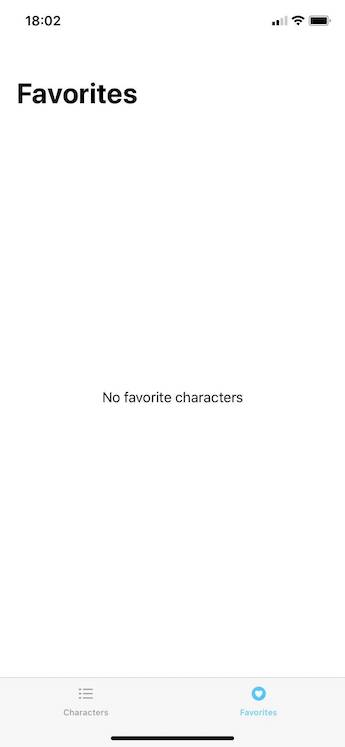

# MComics

## Architecture 
I have used the MVVM Pattern with Combine and SwiftUI. 

For handling the navigations, instead of following the classic Coordinator pattern, I created the CharacterViewFactory that handles the creation and the dependency injection of the views. It follows a protocol. So the idea is of using the Factory pattern for handling the navigation of the views, by using this pattern I was able to use the NavigatioLink from SwfitUI and decoupling the navigation from the view, as it will ask the ViewModel and the ViewModel will return the next view by using the injected view Factory that is just a protocol so I can easily change the flow by just changing the creating of the CharacterViewFactory or by just creating another factory the follows the CharacterViewFactoryProtocol.

## Running 

1 - Run pod install 
2 - Select DEV Scheme. It already comes with the App keys configured. 

## Pods

1 -  SDWebImageSwiftU - Used to load images and cache them. 
2 -  KIF - Used for running fast UI Tests. 
3 -  Quick - Used to write tests on Behavior-Driven Testing style. 
3 -  Nimble - Used to assert unit tests. 
4 -  Swifter - Used to mock server calls. It runs a server on XCode on 8080 port. 

## Unit Tests
For running unit tests you must first select the TESTS Scheme. 

## Screens

### Characters list: 

### Characters Detail: 

character_detail_dark
### Favorites list: 

### Favorites Empty: 

### Offline: 

### Search: 

### Error: 

